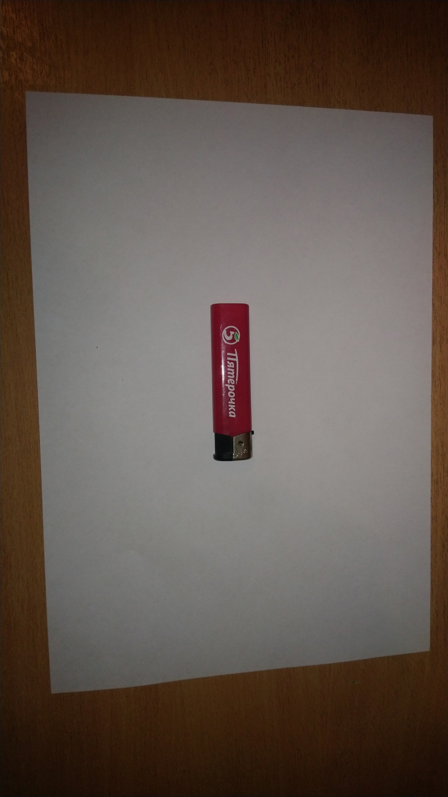
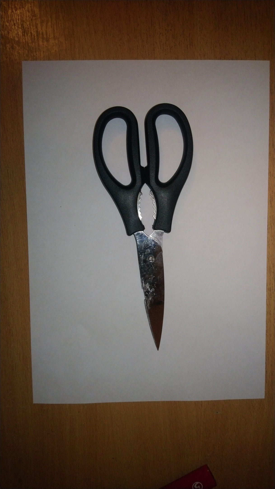

# Intelligent Placer.

## Постановка задачи:
Требуется написать python - библиотеку intelligent_placer_lib, содержащую 1 функцию - точку входа: def check_image. На вход данная функция принимает фотогрфию предметов, изображённых на листе бумаги, а также координаты вершин многоугольника. Данная функция определяет: поместяться ли предметы в многоугольники и в случае успеха возвращает true, иначе false.

## Задание координат многоугольника:
Будем представлять лист бумаги, как координатную плоскость, где ось x соответствует наибольшей стороне листа, а ось y - наименьшей. В качестве единицы измерения по оси x возьмём 1/10 часть соответствующей стороны. Для оси y определяем подобным образом относительно наименьшей стороны. Задание вершин происходит по часовой стрелке, причём координаты соседних вершин - соседние.

## Требования к фотографии предметов:
1. Предметы не должны пересекаться
2. Объектив направлен перпендикулярно поверхности
3. Предметы должны располагаться на белом листе бумаги формата A4.
4. На фото должны быть видны все предметы, а также края белого листа бумаги, на котором они располагаются.
5. Предметы должны иметь чётко выраженные границы

## Набор предметов

