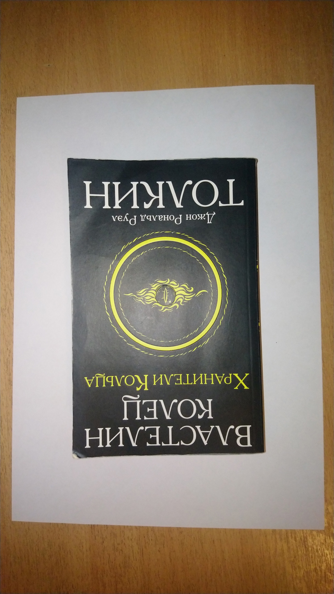
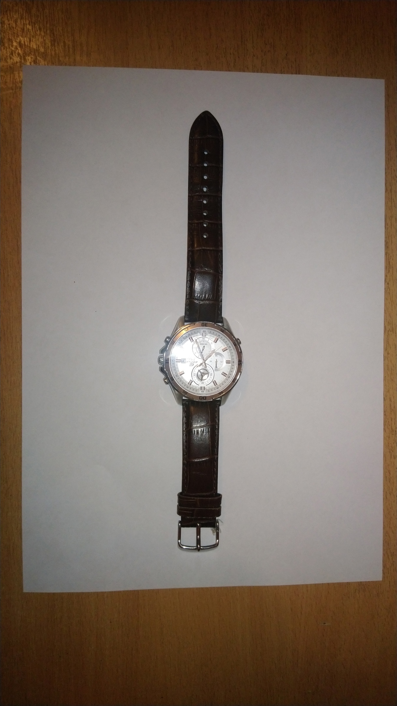
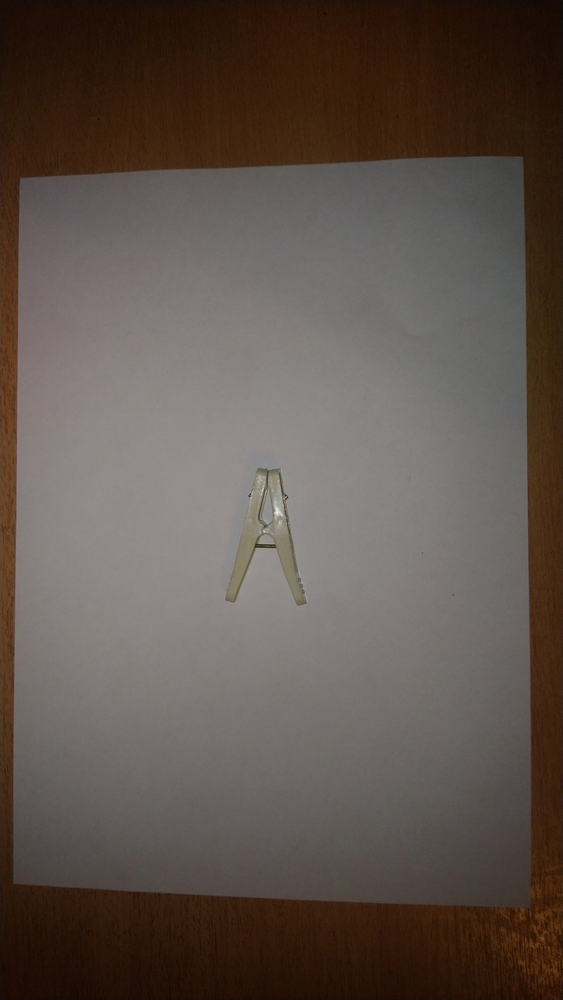

# Intelligent Placer.

## Постановка задачи:
Требуется написать python - библиотеку intelligent_placer_lib, содержащую 1 функцию - точку входа: def check_image. На вход данная функция принимает фотографию предметов, изображённых на листе бумаги, а также координаты вершин многоугольника. Данная функция определяет: поместяться ли предметы в многоугольники и в случае успеха возвращает true, иначе false.

## Задание координат многоугольника:
1. Оси x соответствует наибольшая сторона листа, оси y наименьшая.
2. В качестве единицы по каждой из осей будем брать 1/10 часть соответствующей стороны.
3. Вершины многоугольника задаются списком по часовой стрелке.
4. Количество вершин не превышает 10.

## Требования к фотографии предметов:
1. Предметы не должны пересекаться
2. Объектив направлен перпендикулярно поверхности
3. Предметы должны располагаться на белом листе бумаги формата A4.
4. На фото должны быть видны все предметы, а также края белого листа бумаги, на котором они располагаются.
5. Предметы должны иметь чётко выраженные границы.
6. Фон должен выделяться относительно белого листа бумаги.
7. Камера находится на расстоянии 20 - 25 см относительно поверхности.
8. Равномерное распределение света на изображении.
9. При определении ответа, объекты не могут быть повёрнуты.

## Набор предметов

